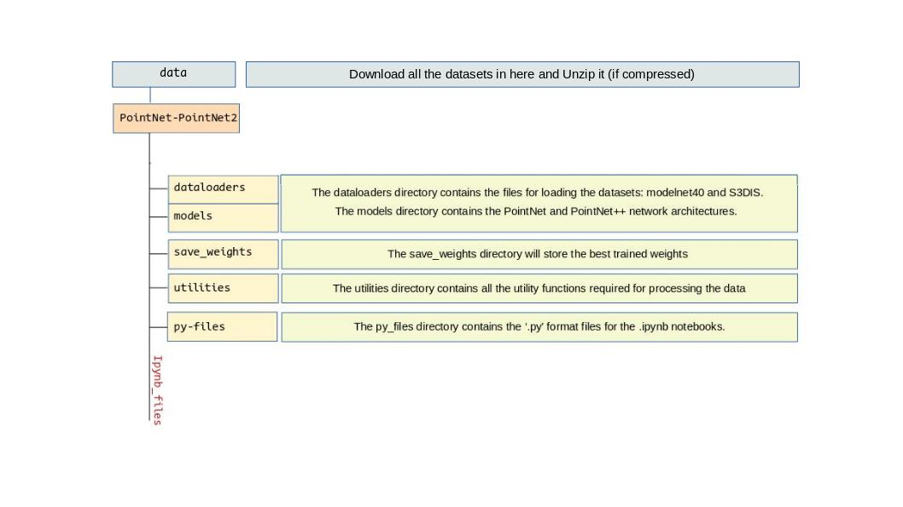

# PointNet-PointNet2
Reimplementation of PointNet and PointNet++ Architecture for Deep Learning with 3D Point Clouds as a part of the CUMULUS Workshop.


## Point Cloud: An Introduction
Point cloud is a collection of points that represents an object, a shape, or a scene (a large collection of points) in 3D. Every point is primarily characterized by its Cartesian Coordinates (X, Y, Z). It may contain secondary attributes (R, G, B, Intensity) etc. 


## Point Cloud and Machine Learning
Point cloud data in 3D is highly irregular. For example, if we assume a subset of points in Euclidean space, they are unordered. Unlike images or volumetric grids, point cloud data is not possible to feed into convolutional neural networks. The point cloud is usually transformed into projections or volumetric grids to apply 2D and 3D-CNNs.

Charles Qi et al. proposed PointNet that takes the raw point cloud as input by considering the point cloud as a set of points. It ceases the need for time-consuming point cloud transformations. 

The PointNet addresses the issue of learning from raw point clouds and considers three fold-solutions: Symmetry function for unordered input, Aggregation of local and global information, and joint alignment network. For the classification, PointNet uses the global features only, while in the case of segmentation, it concatenates both the local and the global features. The extension of PointNet, PointNet++ (from the same authors) addressed the issue in the capturing of the local structures in the metric space. PointNet++ applies PointNet recursively on the input point clouds to exploit the metric space distances to capture the local features in different contextual scales.


For further explanation on the Point Cloud and Machine Learning, go through the following articles:
Qi, Charles R., et al. "Pointnet: Deep learning on point sets for 3d classification and segmentation." Proceedings of the IEEE conference on computer vision and pattern recognition. 2017.
Qi, Charles R., et al. "Pointnet++: Deep hierarchical feature learning on point sets in a metric space." arXiv preprint arXiv:1706.02413 (2017).


## How to run the code?
### Directory Structure

   
### To set up the environment
Make sure you have anaconda installed. (https://www.anaconda.com/products/individual)

run:
```conda env create -f environment_config.yml```

activate conda environment:
```conda activate pointnet```
   
### To run the code
```cd``` to the ```PointNet-PointNet2``` directory.

Launch jupyter notebook by executing,
```jupyter-notebook```

Now, use the web browser that is opened by jupyter-notebook to navigate and choose the ipynb file to run. 

Additionally, we can also run the ```.py``` files by executing,
```python <filename>.py```. The filenames for ```.py``` files correspond the jupyter-notebook files.


## Feedback
contact: fayjie92@gmail.com 